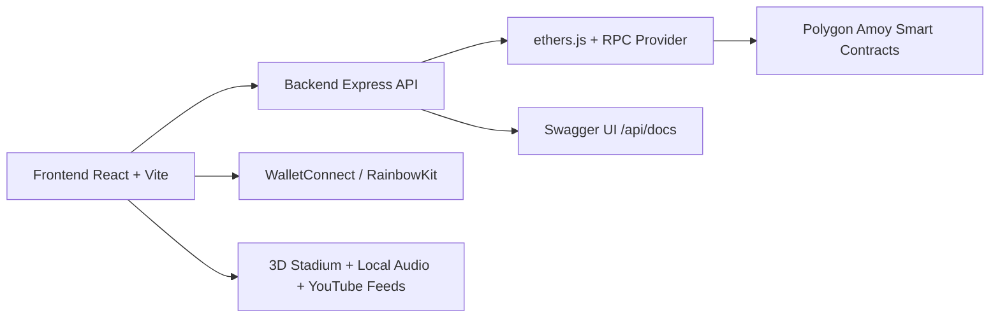

<div align="center">
  
  <h1>Tokenized SPRX</h1>
  <p><strong>Web3 Sports Streaming, NFT Ticketing, and Immersive Stadium Viewing</strong></p>
  <p>
    
    
    
    
    
    
  </p>
</div>

---

## Overview

Tokenized SPRX is a multi-layer Web3 sports platform that combines:

- smart-contract based token, ticket, and access logic
- a Node.js backend with verified on-chain reads and Swagger documentation
- a React/Vite frontend with a high-contrast Web3 landing page
- a 3D stadium experience with live event feeds, mobile immersive fallback, local crowd sound effects, and motion-sensor VR mode

The product now uses **ETH** terminology in the UI while the underlying test network remains **Polygon Amoy** during development. The current user-facing experience is optimized for mobile, ngrok tunneling, live event browsing, and immersive stadium playback.

This project was visually updated using the attached Media reference image and now follows a darker premium sports-dashboard style with glass panels, glow accents, and stock sports imagery.

---

## Current Product Highlights

### Frontend

- Premium landing page with a strong hero section, layered images, and Web3-style cards
- Current-year footer with design credit attribution to Sandeep
- Live Events, Token Exchange, and 3D Stadium tabs
- ETH-labeled network state in the UI
- Mobile-friendly stadium layout with immersive fallback mode when fullscreen APIs are limited
- Motion sensor driven VR camera mode for supported devices
- Embedded YouTube feeds on the stadium screen
- Local crowd ambience and cheer audio assets stored inside the project
- Status messaging for connect, access, and transaction states

### Backend

- Express API with event, exchange, ticket, and stream routes
- Health check endpoint
- Swagger UI documentation at `/api/docs`
- On-chain access verification using ethers.js and configured contract addresses
- Local session tracking for stream start/end workflows

### Smart Contracts

- Upgradeable EIP-1967 Transparent Proxy architecture
- ERC-20 stream token
- ERC-721 access ticket NFT
- Access controller for burn-based access, stablecoin access, and token swaps
- Hardhat test coverage and upgrade support

---

## Architecture



### Layer Breakdown

| Layer | Responsibility |
|---|---|
| Frontend | UI, wallet connection, live events, 3D stadium, audio playback, mobile fullscreen fallback |
| Backend | Event metadata, access verification, session start/end, exchange rates, API docs |
| Contracts | Token minting, NFT ticketing, access control, swap and payment logic |
| RPC / Network | Reads contract state and verifies on-chain access |

---

## UI Reference Direction

The landing page follows the attached Media reference direction with:

- deep navy and indigo backgrounds
- cyan, violet, and electric-blue accent colors
- large expressive headline typography
- rounded glass cards and glowing border treatment
- premium sports imagery with layered compositions
- modern Web3 product styling instead of flat app-like panels

The main hero uses free stock imagery and sports-themed visuals to feel more intentional and editorial.

---

## Repository Structure

```text
ProAI/
├── Contract/                      # Hardhat smart-contract workspace
│   ├── contracts/
│   │   ├── StreamToken.sol
│   │   ├── TokenizedAccess.sol
│   │   └── StreamAccessController.sol
│   ├── scripts/
│   │   ├── deploy.js
│   │   └── upgrade.js
│   ├── test/
│   │   └── Lock.js
│   └── hardhat.config.js
│
├── Server/                        # Express API server
│   ├── src/
│   │   ├── server.js
│   │   ├── config/blockchain.js
│   │   ├── docs/openapi.js
│   │   ├── middleware/errorHandler.js
│   │   ├── routes/
│   │   │   ├── events.js
│   │   │   ├── exchange.js
│   │   │   ├── stream.js
│   │   │   └── ticket.js
│   │   └── utils/helpers.js
│   ├── package.json
│   └── .env.example
│
├── Frontend/                      # React + Vite DApp
│   ├── public/audio/
│   │   ├── crowd-ambience.mp3
│   │   └── crowd-cheer.mp3
│   ├── src/
│   │   ├── App.tsx
│   │   ├── App.css
│   │   ├── index.css
│   │   ├── wallet.ts
│   │   ├── components/
│   │   │   ├── Header.tsx
│   │   │   ├── LandingHero.tsx
│   │   │   ├── Footer.tsx
│   │   │   ├── EventsTab.tsx
│   │   │   ├── ExchangeTab.tsx
│   │   │   └── stadium/
│   │   │       ├── StadiumRoom.tsx
│   │   │       ├── StadiumSeats.tsx
│   │   │       ├── MainScreen.tsx
│   │   │       └── StadiumRoom.css
│   │   ├── hooks/
│   │   └── types/
│   ├── vite.config.ts
│   ├── package.json
│   └── .env.example
│
├── Media/                         # Attached visual reference folder
├── README.md
└── package.json                   # Root start command for frontend + backend
```

---

## Technology Stack

| Area | Technology |
|---|---|
| Smart Contracts | Solidity 0.8.28, Hardhat 2.27, OpenZeppelin upgradeable patterns |
| Frontend | React 18, Vite 7, RainbowKit, wagmi, viem, ethers.js, @react-three/fiber |
| Backend | Node.js, Express 4, ethers.js, Swagger UI, dotenv, cors, helmet |
| UI/UX | Glassmorphism, responsive hero layout, mobile immersive stadium mode |
| Media | Local MP3 crowd audio, embedded YouTube feeds, free stock sports images |
| Network | Polygon Amoy during development; UI wording now uses ETH terminology |

---

## Smart Contract Layer

All contracts follow an upgradeable proxy model. The current architecture separates token logic, ticket logic, and access logic so each responsibility can evolve independently.

### StreamToken.sol

The SPRX ERC-20 token contract.

Existing functions and operations:

- `initialize(name, symbol, initialSupply, defaultAdmin)`
- `mint(to, amount)`
- `mintRewards(to, amount)`
- `setMinter(account, allowed)`
- `pause()`
- `unpause()`
- standard ERC-20 behavior through OpenZeppelin upgradeable modules

Purpose:

- issue SPRX supply
- support rewards and controller-based minting
- allow controlled pause/unpause during emergencies

### TokenizedAccess.sol

The ERC-721 NFT access and ticket contract.

Existing functions and operations:

- `initialize(name, symbol, royaltyReceiver, royaltyFeeNumerator, defaultAdmin)`
- `mintTicket(to, eventId, accessLevel, seat, uri)`
- `hasTicketForEvent(owner, eventId)`
- `setDefaultRoyalty(receiver, feeNumerator)`
- pause / unpause operations

Purpose:

- mint NFT event tickets
- store ticket metadata
- verify event attendance and access ownership

### StreamAccessController.sol

The access and exchange controller.

Existing functions and operations:

- `initialize(streamToken, ticketContract, stablecoin, sprxPerStable, stableCostPerMinute, feeBps, defaultAdmin)`
- `burnForAccess(eventId, accessMinutes, burnAmount)`
- `payStableForAccess(eventId, accessMinutes)`
- `buyTokens(stableAmount)`
- `sellTokens(sprxAmount)`
- `hasAccess(user, eventId)`
- `withdrawFees(to)`
- `setRates(sprxPerStable, stableCostPerMinute, feeBps)`

Purpose:

- gate event access
- support token burn flows and stable payment flows
- manage exchange rates and fee accounting

### Security / Upgrade Notes

- Transparent proxy pattern keeps the proxy address stable during upgrades
- `_disableInitializers()` is used on implementations
- a manual reentrancy lock is used in the controller for compatibility with the current OpenZeppelin v5 setup
- access rules and fee logic are admin-controlled through roles

---

## Backend API Reference

Base URL for local development: `http://localhost:8000`

Swagger docs: `http://localhost:8000/api/docs`

### Health and Metadata

| Method | Endpoint | Description |
|---|---|---|
| `GET` | `/api/health` | Health check with timestamp |
| `GET` | `/api/events` | Returns all event metadata |
| `GET` | `/api/events/:id` | Returns a single event by id |

### Exchange

| Method | Endpoint | Description |
|---|---|---|
| `GET` | `/api/exchange/rate` | Returns SPRX/USDC rate data and fee basis points |

### Ticket Verification

| Method | Endpoint | Description | Body |
|---|---|---|---|
| `POST` | `/api/ticket/verify` | Verifies if a wallet holds a ticket NFT for an event | `{ wallet, eventId }` |

### Streaming Sessions

| Method | Endpoint | Description | Body |
|---|---|---|---|
| `POST` | `/api/stream/start` | Starts a stream session after access validation | `{ wallet, eventId }` |
| `POST` | `/api/stream/end` | Ends a stream session and returns duration | `{ sessionId }` |

### API Response Notes

- event and exchange routes are currently backed by a mix of static data and on-chain reads
- ticket and stream routes validate wallet addresses before proceeding
- access-denied responses are returned when controller verification fails
- backend errors are routed through a common error handler

---

## Frontend Feature Guide

### Root Layout and Navigation

The app now includes:

- header with token balances and ETH status badge
- premium landing hero with stock sports images
- footer with current year and Sandeep design credit
- tab navigation for Live Events, Token Exchange, and 3D Stadium

### Landing Page

The landing page is now the primary brand surface.

Current behavior:

- headline uses a bold editorial style
- hero pills show ETH network state and access eligibility
- stock imagery is used to create a more cinematic sports presentation
- the visual language uses gradients, glow accents, and layered glass cards

### Live Events Tab

Current behavior:

- renders event cards from backend data
- displays live badge and event time
- uses ETH access gating messaging
- shows a modal for event access checks
- modal closes on button click or Escape key
- connect wallet flow is initiated from the modal when needed

### 3D Stadium Tab

Current behavior:

- mobile-responsive stadium room layout
- fullscreen VR mode with motion sensor support
- mobile immersive fallback when fullscreen is not supported by the browser
- embedded YouTube feed on the stadium screen
- next-feed rotation for multiple stock YouTube links
- local crowd ambience and crowd cheer MP3 playback
- control buttons for sound and VR modes
- audience seats animated to create a more realistic crowd feel

### Footer

Current behavior:

- displays the current year automatically
- credits design to Sandeep
- fits the dark premium landing-page theme

---

## UI / UX Implementation Notes

The latest UI iteration is intentionally more premium and sports-first.

Design goals currently implemented:

- strong contrast and neon-accent color balance
- modern card layering with soft glow and depth
- larger hero typography and compact support text
- responsive controls that still work on mobile screens
- motion-sensor stadium exploration on supported devices
- fallback immersive mode for mobile browsers that cannot enter true fullscreen

The product now behaves better as a mobile Web3 experience instead of only a desktop demo.

---

## Local Media Assets

The project now includes local audio assets for the stadium experience:

- `Frontend/public/audio/crowd-ambience.mp3`
- `Frontend/public/audio/crowd-cheer.mp3`

These are used to give the stadium audio layer a reliable local playback path rather than depending on browser-generated sound only.

---

## Setup Guide

### Prerequisites

- Node.js 18 or newer
- npm
- MetaMask or another EIP-1193 wallet
- Polygon Amoy testnet funds for contract work
- WalletConnect Project ID for the frontend wallet modal

### 1. Install Smart-Contract Dependencies

```bash
cd Contract
npm install
```

### 2. Install Backend Dependencies

```bash
cd Server
npm install
```

### 3. Install Frontend Dependencies

```bash
cd Frontend
npm install
```

### 4. Run the Full Stack From Root

```bash
npm run start
```

Root start behavior:

- frontend runs on `http://localhost:3000`
- backend runs on `http://localhost:8000`
- frontend uses strict port mode so it does not silently switch to another port

### 5. Swagger UI

```text
http://localhost:8000/api/docs
```

### 6. Frontend over ngrok / tunnel

The frontend is configured to allow the current ngrok host used in this workspace so the web view can load through the tunnel.

If you change tunnel hostnames, update `Frontend/vite.config.ts` accordingly.

---

## Common Operations

### Smart Contracts

Compile:

```bash
cd Contract
npx hardhat compile
```

Test:

```bash
cd Contract
npx hardhat test
```

Deploy to Amoy:

```bash
cd Contract
npx hardhat run scripts/deploy.js --network amoy
```

Upgrade a proxy implementation:

```bash
cd Contract
npx hardhat run scripts/upgrade.js --network amoy
```

### Backend

Start the API server:

```bash
cd Server
npm start
```

Access docs:

```text
http://localhost:8000/api/docs
```

### Frontend

Start development server:

```bash
cd Frontend
npm run dev
```

Build for production:

```bash
cd Frontend
npm run build
```

---

## Environment Variables

### Contract/.env.example

```env
PRIVATE_KEY=<your-deployer-private-key>
POLYGON_RPC_URL=https://polygon-rpc.com
AMOY_RPC_URL=https://rpc-amoy.polygon.technology
```

### Server/.env.example

```env
PORT=8000
RPC_URL=https://rpc-amoy.polygon.technology
TICKET_ADDRESS=<TokenizedAccess proxy address>
ACCESS_ADDRESS=<StreamAccessController proxy address>
TOKEN_ADDRESS=<StreamToken proxy address>
```

### Frontend/.env.example

```env
VITE_APP_BACKEND_URL=http://localhost:8000
VITE_APP_TICKET_ADDRESS=<TokenizedAccess proxy address>
VITE_APP_TOKEN_ADDRESS=<StreamToken proxy address>
VITE_APP_ACCESS_ADDRESS=<StreamAccessController proxy address>
VITE_APP_CHAIN_ID=80002
VITE_APP_WALLETCONNECT_PROJECT_ID=<your-walletconnect-project-id>
VITE_APP_USDC_ADDRESS=0x3c499c542cEF5E3811e1192ce70d8cC03d5c3359
```

---

## Development Notes

- The UI currently uses ETH wording while the wallet/chain logic still targets Polygon Amoy during development.
- The stadium screen supports multiple embedded stock YouTube feeds.
- Audio playback is intentionally local so the crowd experience remains predictable under tunnel conditions.
- iOS and some mobile browsers may use immersive fallback mode instead of full fullscreen due to browser security limitations.
- The frontend uses same-origin-style API access through environment configuration so it can work behind tunnels.

---

## Future Scope

- Native WebXR stadium mode with true immersive headset support
- Better motion-control calibration for mobile gyroscope input
- Real crowd simulation with layered animated audience clusters
- More sports-specific stock media feeds and event themes
- Live audio mixing and per-channel volume controls
- Dynamic event scoring overlays inside the 3D screen
- WebSocket-based live match synchronization
- IPFS or Livepeer media storage for decentralized video streams
- Chain abstraction so the UI can switch between ETH, Polygon, or other supported networks with a single config layer
- DAO voting for event curation, featured matches, and experience upgrades
- Reward badges for viewers and loyal participants
- Bundle splitting and lazy loading for the wallet-heavy frontend dependencies
- Analytics for event impressions, stadium entry, and watch time

---

## Testing / Validation Status

- Smart contracts have Hardhat test coverage
- Backend routes are documented in Swagger
- Frontend builds successfully after the recent UI and stadium upgrades
- Stadium experience includes mobile fallback and local audio playback

---

## License

This project is released under the **MIT License**.

---

## Author

**Tokenized SPRX**

Developed by **Sandeep**

© 2026, All rights reserved.
